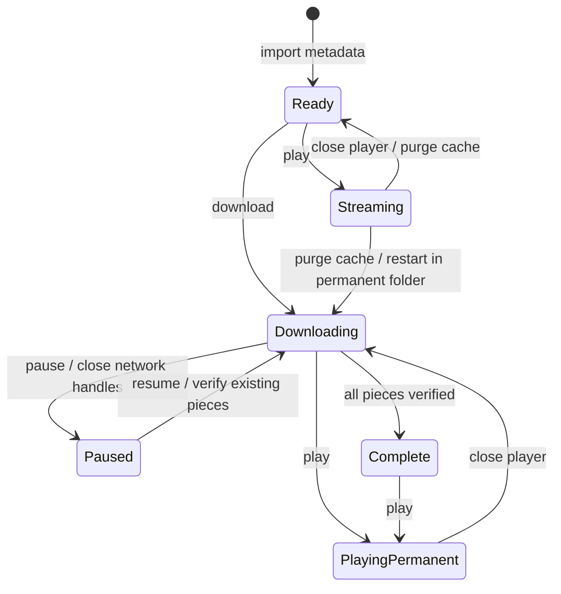

# SeedStream Desktop Design

## Product scope

SeedStream is a small macOS and Windows desktop application with two core features:

1. Import a local `.torrent` file and stream a supported video before the full torrent finishes.
2. Download all files in a torrent to a user-selected permanent folder with pause and resume support.

The UI stays intentionally small: open or drop a torrent, inspect its files, then choose **Play** or **Download**. It does not accept arbitrary remote web pages or execute content from a torrent.

## Architecture

Electron hosts a local-only renderer. The renderer has no Node.js integration and receives a narrow, validated API through a context-isolated preload script. WebTorrent, filesystem access, persistence, and the loopback streaming server live in the main process.

Imported torrent metadata is parsed before network activity starts. The info hash is the stable task identifier and prevents duplicates. Torrent paths are rejected if they are absolute, contain parent traversal, or resolve outside the selected root.

## Storage and lifecycle invariants

Streaming and downloading deliberately use different storage policies:

- Stream-only data is stored below an application-owned cache root and is removed when playback closes or the app exits.
- Interrupted permanent downloads stay in the configured download directory and are restored on the next launch.
- Starting a permanent download from an active stream first closes the stream and purges its cache, then re-adds the torrent at the permanent path. This avoids mixing temporary and user-owned files. Already buffered stream pieces may need to be downloaded again.
- Playing a task that is already downloading reuses the same torrent object and permanent files.
- Removing a permanent task removes the application record but does not delete downloaded files.

## Playback

WebTorrent's Node HTTP server binds to `127.0.0.1` on an ephemeral port and serves byte ranges. The server uses a random base path per launch. The HTML video element requests ranges; WebTorrent prioritizes the pieces needed for the current playback position. Seeking therefore changes piece priority naturally.

The first release supports video containers/codecs Chromium can decode, including typical MP4, WebM, MOV, M4V, and compatible MKV combinations. Unsupported codecs produce a visible playback error and remain available for permanent download.

## Cross-platform behavior

The application uses Electron APIs for downloads, temporary storage, file dialogs, notifications, and opening folders. Packaging declares `.torrent` associations for both macOS and Windows. macOS receives Finder `open-file` events; Windows uses the single-instance command-line path flow. Build targets are DMG/ZIP for macOS and NSIS/portable EXE for Windows.

Unsigned development builds may trigger Gatekeeper or SmartScreen. Production distribution requires separate Apple and Microsoft signing credentials.

## Failure handling and verification

Malformed torrents, duplicate hashes, unsafe paths, missing source metadata, unavailable peers, permission failures, and playback codec errors are represented as task-level errors rather than process crashes. State writes are atomic. Startup removes stale ephemeral cache but never recursively deletes outside the owned cache root.

Automated tests cover parsing helpers, media detection, path safety, state transitions, cache boundaries, persistence, and renderer formatting. A local generated torrent supplies the integration smoke test without relying on public copyrighted content.

